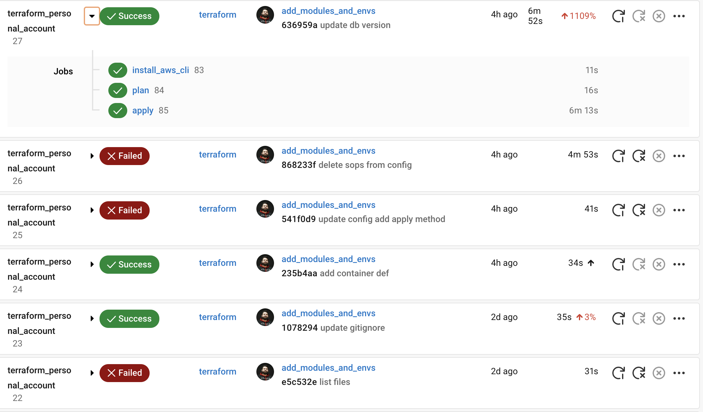
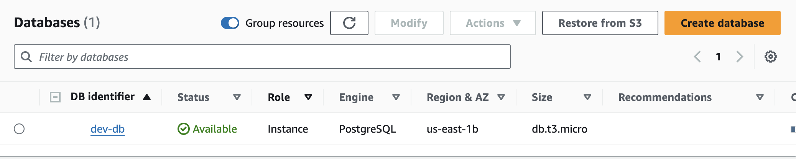
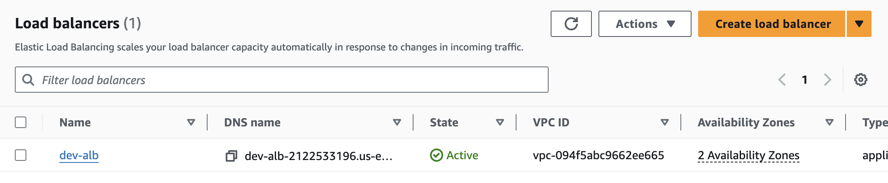

Here’s the updated README content with the additional instructions:

---

# Terraform Personal Account Configuration

This repository contains Terraform configurations for managing a personal AWS account. Below is an explanation of each module included in this repository.

## Modules

### ecr
- **main.tf**: Configures AWS Elastic Container Registry (ECR) to store Docker images.
- **variables.tf**: Defines input variables such as repository name.
- **outputs.tf**: Specifies outputs like the repository URL.

### ecs
- **main.tf**: Configures Amazon Elastic Container Service (ECS), including task definitions and services.
- **variables.tf**: Defines input variables such as cluster name and task definition parameters.
- **outputs.tf**: Specifies outputs like the ECS cluster ARN.

### elb
- **main.tf**: Sets up Elastic Load Balancing (ELB) resources, including load balancers and listeners.
- **variables.tf**: Defines input variables such as load balancer type and listener ports.
- **outputs.tf**: Specifies outputs like the DNS name of the load balancer.

### networking
- **main.tf**: Manages VPC, subnets, route tables, and other networking resources.
- **variables.tf**: Defines input variables such as VPC CIDR block and subnet configurations.
- **outputs.tf**: Specifies outputs like VPC ID and subnet IDs.

### rds
- **main.tf**: Configures Amazon RDS (Relational Database Service) instances and related resources.
- **variables.tf**: Defines input variables such as database engine, instance class, and storage.
- **outputs.tf**: Specifies outputs like the RDS endpoint and instance identifier.

## Continuous Integration

You can view and manage the CI/CD workflow in CircleCI. The CircleCI configuration is set up to automatically plan and apply the Terraform changes. Visit the [CircleCI dashboard](https://circleci.com) to see the workflow, review the plans, and apply the changes if necessary.




## Getting Started

To use these modules, ensure you have Terraform installed and AWS credentials configured. Clone the repository and navigate to the desired module to customize the variables and apply the configurations.

```bash
git clone https://github.com/YahyaMohand/terraform_personal_account.git
cd terraform_personal_account
```

Initialize Terraform and apply the configurations:

```bash
terraform init
terraform plan -var-file=secrets/terraform.dev.tfvars
terraform apply -var-file=secrets/terraform.dev.tfvars
```





## Cleanup

After you are done, make sure to remove the resources to avoid unnecessary AWS charges:

```bash
terraform destroy -var-file=secrets/terraform.dev.tfvars
```


---

You can customize the details in the README file as needed.
